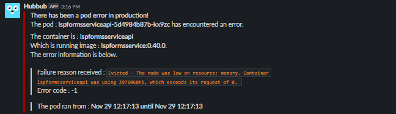
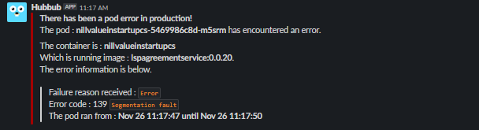

# Hubbub 


Hubbub is a small application that runs locally inside of a Kubernetes cluster with a given service account and watches a given namespace. If a pod failure is seen (SEGFAULT, Eviction etc..) in the namespace Hubbub is watching it will send a notification containing the information about the pod and container. It has no external dependencies outside of the STDLIB and Kubernetes packages.

<br>
<br>

<p align="center">
	<br>
  
</p>


<br><br>


## Installation and setup
At this time Hubbub is not hosted in any public image repository so you will need to build the image yourself and then deploy it to a kubernetes cluster. The following steps will walk you through that process.
> If using slack you will also need a slack webhook. This readme does not go into the specifics for creating one, if you need assistance please see <a href="https://api.slack.com/messaging/webhooks">this page.</a>

<br>

#### Build the docker image
Clone this repository by running 
```shell
 git clone https://github.com/jxmoore/Hubbub`
 cd /Hubbub
 ```
Once cloned you will want to create the config file to suite your needs, while there are various options for an MVP approach update the example config found in <a href="docs/exampleConfig1.json"> /docs/exampleConfig1.json </a>. You will want to change the namespace, webhook and slack channel to match your enviroment. 

```json
{
	"namespace": "YOUR NAMESPACE",
	"Self": "Hubbub",
	"slack": {
		"webhook": "YOUR WEBHOOK",
		"channel": "#YOUR SLACK CHANNEL"
		}
}
```
For a run down of all of the configuration options and enviroment variables used by Hubbub please see the <a href="docs/Config.md"> config</a> document in this repo. Save this file in the root of /Hubbub and call it config.json. With the json created, we can build the docker image by running the following :

```shell
 docker build . -t <repoName>:<versionTag>
 docker push . -t <repoName>:<versionTag>
```

#### Deploy to Kubernetes 
Once you have pushed the image to a repository you can now deploy it to kubernetes. To do this update the YAML file found in this repository <a href="hubbub.yaml"> /Hubbub/hubbub.yaml </a> to match your enviroment. You will wnat to put hubbub in the appropriate Namespace, update any enviroment variables you would like to use and ensure that the image points to the one you just pushed : 

```diff
apiVersion: apps/v1beta1
kind: Deployment
metadata:
   name: hubbub
-  namespace: default
+  namespace: blockChaining
spec:

    ...

        - name: hubbub
-        image: repo:5000/hubbub:0.1
+        image: YOURREPO/hubbub:VERSION
        env:
-        - name: AZMON_COLLECT_ENV
-          value: "FALSE"            
+        - name: HUBBUB_USER
+          value: "Jobo"        
```

You can change the deployment, clusterRole, binding and service account to however you see fit but : 
* Hubbub requires **GET, WATCH and LIST** permissions. 
* Hubbub will try to exclude itself from notifications, meaning it wont alert on a pod/container that matches Hubbub. If you change the deployment and container names update the *Self* config option or set the `HUBBUB_SELF` enviroment variable.

Once deployed you are off to the races! Hubbub should now be watching the namespace you specified in the config.json file and will alert via a slack message on any container or pod issues :

<br>

<p align="center">
  
</p>
<br>

If you encounter issues running Hubbub please see the <a href="docs/Troubleshooting.md"> troubleshooting</a> document in this repo.
<br> 

## Config
There are two ways to tune and configure Hubbub, either through a configuration file `config.json` provided to the binary at runtime (via **-c FILEPATH**) or through enviroment variables. 
<details><summary><b>The enviroment variables and what they control</b></summary>
</details>
<details><summary><b>The json fields and what they control</b></summary>
</details>

<br>

>For an example of a configuration with all of the settings supplied see  <a href="docs/exampleConfig2.json"> /docs/exampleConfig2.json</a>.
<br>


## Building locally
If building the application locally do so outside of $GOPATH and ensure that you are using at least go V1.12. Aside from that a simple `go build .` in the PWD should result in a built binary. However Hubbub uses the InCluster config (this will change in the future), so a built locally binary will do you no good unless your troubleshooting the build or planning on moving it to a container in a cluster. 

The supplied dockerfile can be used to build a useable docker image, see <a href="#Build-the-docker-image"> Build the docker image</a> above.

Download:
```shell
go get github.com/jxmoore/hubbub
```
If you do not have the go command on your system, you need to [Install Go](http://golang.org/doc/install) first.

<br>

### TODO
- Update GetKubeClient() to allow using a local config for testing outside of a cluster.
- Implement the LabelSelectors.
- The 'value' field in the slack post should be exsposed in the config and should take Go templating syntax.
- More notification types, e.g. SMTP